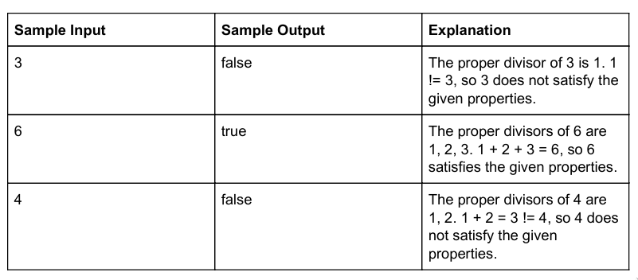

# Perfect

You, a recent college graduate and head of a growing urban architecture firm,
have just received your first job! Your client, the University of Pennsylvania,
wants you to design the newest and most expensive dormitory on Penn's campus
with a specific property (to make it the most expensive dormitory on campus):
the height of the dormitory is equal to the sum of its proper divisors. That is,
the height is equal to the sum of its positive divisors, not including itself.
Your client hands you a list of possible building heights that they are
currently examining and wants you to tell them which buildings satisfy this
special property. Can you write a function that determines whether each height
satisfies this property?

## Input Format

The first line is the number of integers in the input file. Each following lines
consists of an integer `0 <= n <= 100000000`.

## Output Format

Return `true` if the number satisfies the given properties, `false` otherwise.

