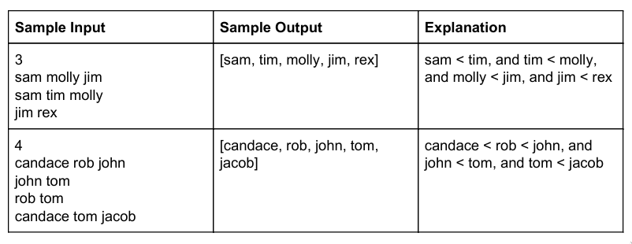

# Tower Tycoon

As head architect of your architecture firm, you have been tasked with designing
a new residency for residents that use to live in an older retirement home. Each
resident has been assigned to a specific floor, and each floor has only one
resident. You want the order of the resident in the building to match the order
they were in previously, so you ask each resident to tell you their old floor
number. Unfortunately, while none of the resident remember their old floor
number, they each remember their position in the building relative to some of
their neighbors. For example, Dorothy remembers that she is somewhere above John
and Grace, but somewhere below Jim. Given several lists of each of the members
relative positions in order from lowest to highest, write a program that outputs
the order of the residents from bottom floor to top. You can assume that there
is always exactly one correct ordering of the floors.

## Input Format

The number of lists, followed by each list of names. The names are separated by
one space.

## Output Format

Output a list of participants in order from lowest floor to highest floor.

