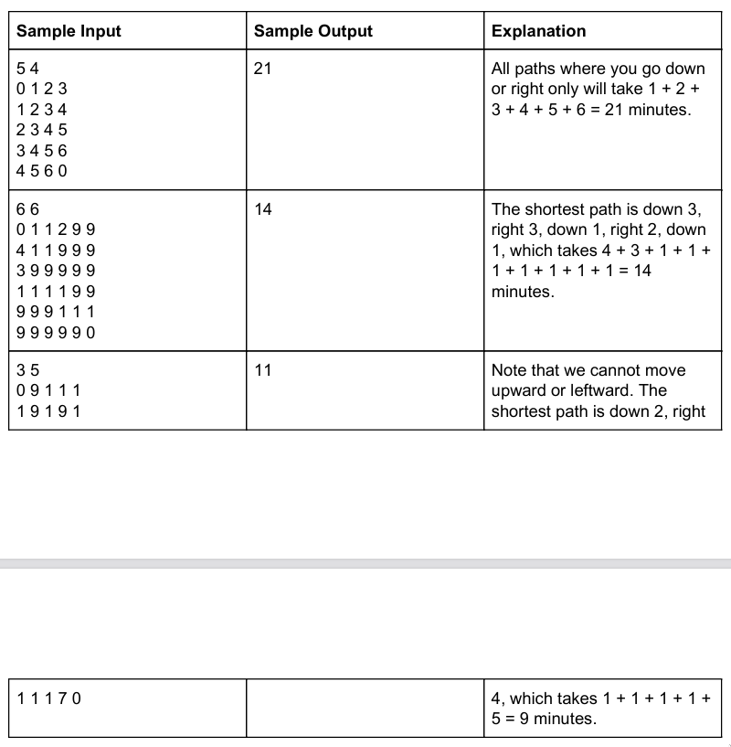

# Stressful Park

The city has an old park that is notorious for its windy paths and maze-like
structure. In addition to the park's complicated layout, certain sections of the
park take longer to traverse due to hilly terrain, lakes, etc. Unsurprisingly,
citizens who regularly visit the park have filed complaints about getting lost
in the park and not being able to find their way to the exit in a reasonable
amount of time. As a result, your boss has assigned you the task of marking the
shortest paths from given locations in the park to their nearest exit.

You are given a 2D array of size N x M where index (0, 0) is the starting
location and index (N - 1, M -1) is the nearest exit. The value in each cell of
the array indicates how many minutes it takes to traverse that section of the
park. Note that the values at index (0, 0) and (N - 1, M - 1) will be 0. Your
job is to find the shortest number of minutes it would take to reach the nearest
exit. For simplicity sake, you are only allowed to move downward and rightward
throughout the array. Also, you do not need to worry about outputting the
shortest path itself.

## Input Format

First line contains two integers, N and M.

The next N lines contain M integers each, where the Mth integer on the Nth line
will contain the value of the array at index (N - 1, M - 1).

## Output Format

Output a single integer representing the shortest number of minutes to reach the
exit.

